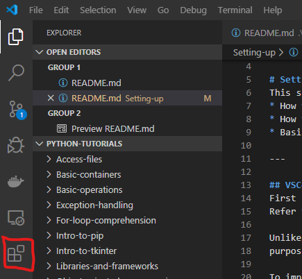
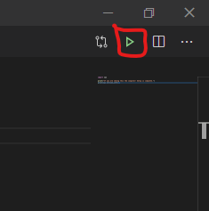

# Setting up
This section will show you:
* Basic usage of Git
* How to get VSCode up and running for Python
* How to build these slides
* Installation of Python 3+

---

## Git and this repo
If you haven't already done so please install git and clone this repository.
Git can be installed from, https://git-scm.com/.

If you don't know what that means don't worry, keep reading.

---

## What is git?
>Git is a type of version control system (VCS) that makes it easier to track
>changes to files. For example, when you edit a file, git can help you determine
>exactly what changed, who changed it, and why.
(Kevin Cooper, https://hackernoon.com/understanding-git-fcffd87c15a3)

TODO split this
It also allows multiple users to `clone` the current state of the code from a
central repository. This is useful if you have a new computer or you have a new
team member who needs to start working on the codebase.

Additionally, it allows user to `push` and `pull` new changes (or `commits`) to
and from the server. Thus multiple people can be working *at the same time* on
the same codebase and have all their work marry together seamlessly (most of the
time).

---

## Git vs GitHub vs GitLab vs ...
If you are unfamiliar with git perhaps you have heard of GitHub or GitLab.
Both these companies host git systems. Think of them like YouTubes for code,
companies and individuals are able to host their content on the GitHub/GitLab
servers.

---

## Cloning this repo
So now we have git installed on our system it's time to `clone` this repository.
These tutorials are being hosted on GitHub. Thus if we go to,
https://github.com/Joshua-Hwang/python-tutorials, we should see a green button
telling us to clone or download.

We could just download a static zip of the repo but this won't allow us to `pull`
new updates if these tutorials ever change.
TODO: SPLIT THIS
In Windows you will be provided options like `Open Visual Studio` or `Open in
Desktop` both of these are fine. If you are not on Windows or you just prefer
the command line approach, open a terminal and navigate to a place where you 
want to clone the repo then type,
`git clone https://github.com/Joshua-Hwang/python-tutorials.git`.

---

## Visual Studio Code
We will choose to use the Visual Studio Code IDE (Integrated Development
Environment) since it is quite general, multi-platform and easy to pickup.

Now install Visual Studio Code.
Refer to your platforms appropriate installation method.

Unlike other IDEs that offer development for specific a specific language or
purpose. Visual Studio Code on it's own is very bare-bones and general.

To improve the experience we will need to install some extensions.

---

Search for Python and install the Microsoft official extension.

---

## The slides
Likely if you are reading this for the first time.
These slides are not in their readable state yet.

To remedy this also install the Marp for VS Code.

---

## Using Visual Studio Code
We will let you get acquainted to the environment on your own for the most part.
But there is an important area that needs to be mentioned.
* Ctrl-Shift-P will open the command palette which allows you to use additional functionality

To preview these slides properly, open the command palette and look for
`Markdown: Open Preview`

---

## Starting to code
If all has gone well then we should be able to start coding now.
As a test open the test.py file in VSCode and look for the green play button at
the top right.

